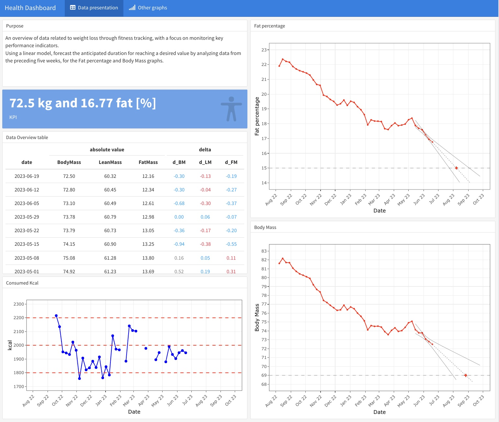

### Hi there 👋, I'm Andrés Acuña Marroquín
#### Biostatistician/Data Scientist

My name is Andres, and I have extensive experience as a biostatistician/data scientist in the field of biotechnology product development. I have played a crucial role by offering statistical guidance, analyzing key performance indicators for various biotechnology products, and generating comprehensive reports to showcase their performance. Throughout my career, I have primarily utilized R for these tasks. To get a glimpse of the reports I have worked on, you can explore the examples available in my repositories.

Skills: R / Statistics / Data Visualisation / R Package / ShinyApps

## Examples of work 
 

- 🔭 I’m currently working on this page. 

